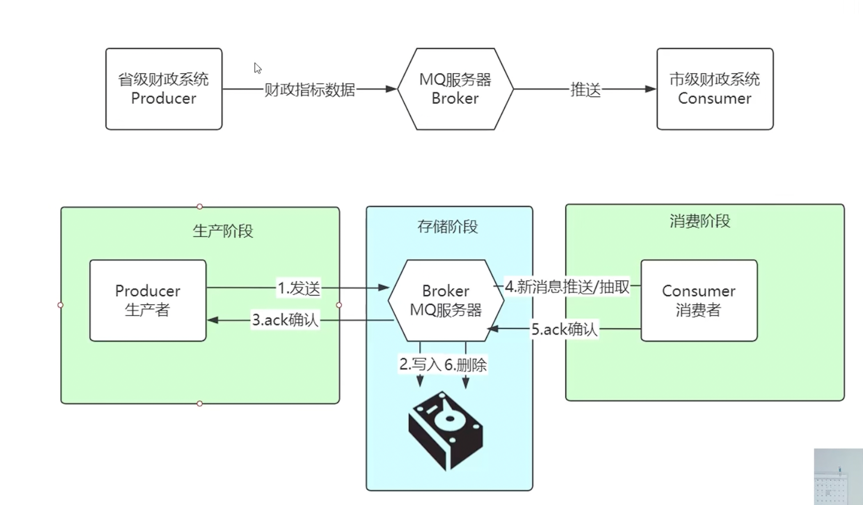
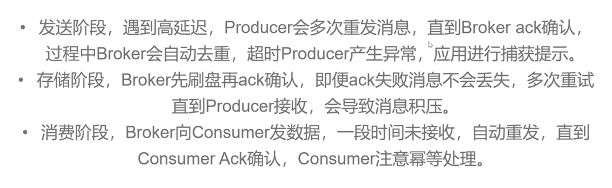

## 旨在学习 mq 方面的配置以及高级特性

1. mq 可靠性投递
2. 防止重复消费
3. 手动 ack
4. 预防 mq 阻塞方面

### 会发生消息丢失的情况
1. 生产者宕机
2. broker宕机(使用消息持久化来解决)
3. 消费者宕机

### 消息会被重复消费的场景
1. 网络抖动导致业务处理成功但是 ack 失败
2. 消费者意外重启
3. Broker 故障恢复
4. 手动 Ack 配置不当

### 关于死信队列
1. 死信队列一般把死信消息持久化入库,后续进行人工处理或审计
2. 死信消息的产生原因包括消息被拒绝、消息过期、队列达到最大长度
3. 需要配置死信交换机和相应的处理机制
4. 建议建立监控和定期分析机制